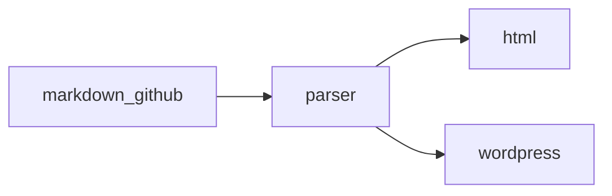

# GitHub Flavored Markdown full syntax packet

This document intentionally exercises the rendered syntax surface of GitHub Flavored Markdown. It includes CommonMark leaf blocks, container blocks, inline syntax, and the GFM extensions for tables, task list items, strikethrough, autolinks, and raw HTML filtering.

Setext heading level 1
======================

Setext heading level 2
----------------------

## Paragraphs, breaks, and escapes

Adjacent lines in one paragraph
stay in one rendered paragraph unless a blank line separates them.
This next line uses a backslash hard break.\
This line follows the backslash hard break.

Backslash escapes render punctuation literally: \*not emphasis\*, \[not a link\], \# not a heading, and \`not code\`.

Character references render as characters: &amp; &lt; &gt; &quot; &#35; &#x1F680;.

---

***

___

## Emphasis, strong emphasis, and strikethrough

This paragraph uses *asterisk emphasis*, _underscore emphasis_, **asterisk strong**, __underscore strong__, ***combined strong emphasis***, ___combined underscore strong emphasis___, and ~~GFM strikethrough~~.

Intraword underscores should stay literal in snake_case_identifier, while intraword emphasis can still appear as foo*bar*baz.

## Code spans

Use `inline code`, ``code with ` one backtick``, and `` spaced code span `` inside normal prose.

## Indented and fenced code blocks

    Four leading spaces create an indented code block.
    Markdown syntax like **strong** stays literal here.

```php
<?php
function render_packet(array $items): string
{
    return implode("\n", array_map('strtoupper', $items));
}
```

~~~js
const rows = ["tables", "tasks", "autolinks"];
console.log(rows.map((row) => row.toUpperCase()).join(", "));
~~~

````
Fence length can contain shorter fences:
```
not the end of this block
```
````



## Block quotes

> A block quote can contain a paragraph with **inline formatting**.
>
> - A list inside a quote
> - A second item with `code`
>
> > Nested quotes should remain nested.

> [!NOTE]
> GitHub alert syntax should render as a callout-style block when supported.

> [!TIP]
> Alerts can include [links](https://docs.github.com/) and **formatting**.

> [!IMPORTANT]
> Important callouts should survive as quoted content even without native alert blocks.

> [!WARNING]
> Warning callouts exercise another alert label.

> [!CAUTION]
> Caution callouts complete the GitHub alert set.

## Lists

- Tight unordered item one
- Tight unordered item two
  - Nested bullet
  - Nested bullet with **strong text**

* Asterisk bullet marker
+ Plus bullet marker
- Hyphen bullet marker

1. Ordered item one
2. Ordered item two
   1. Nested ordered item
   2. Nested ordered item with `code`
3. Ordered item three

1999. Ordered lists can start at a non-one number.
2000. The next marker should continue the list.

- Loose unordered item with a paragraph.

  Continuation paragraph in the same list item.

- Second loose item with a nested quote.

  > Quote inside a loose list item.

1. Loose ordered item with a paragraph.

   Continuation paragraph in the ordered item.

2. Second loose ordered item.

## Task list items

- [x] Parse checked task list syntax
- [X] Parse uppercase checked task markers
- [ ] Preserve unchecked tasks
- [x] Render nested formatting with **bold and _italic_ text**
  - [ ] Nested follow-up task with `inline code`
  - [x] Nested completed task with ~~old wording~~

## Tables

| Feature | Rendered example | Alignment |
| :--- | :---: | ---: |
| Bold | **This is bold text** | left |
| Italic | _This text is italicized_ | center |
| Strikethrough | ~~This was mistaken text~~ | right |
| Inline code | `git status --short` | code |
| Link | [OpenAI](https://openai.com/) | link |
| Escaped pipe | `a \| b` | cell |
| Entity | &copy; 2026 | entity |

| Short header | Extra body cell |
| --- | --- |
| Missing body cell |
| Body | cells | beyond | header |

## Links

Inline link: [OpenAI](https://openai.com/ "OpenAI home").

Reference link: [GitHub Flavored Markdown spec][gfm].

Collapsed reference link: [CommonMark][].

Shortcut reference link: [GitHub Docs].

Reference labels can be reused with different casing: [gfm].

Autolink URI: <https://github.github.com/gfm/>.

Autolink email: <support@github.com>.

Bare GFM autolinks: https://github.com/openai, http://example.com/a_(b), www.github.com, and user@example.com.

Issue-like and mention-like tokens should remain visible: #42, GH-123, @octocat, and @github/docs.

[gfm]: https://github.github.com/gfm/ "GFM spec"
[CommonMark]: https://spec.commonmark.org/
[GitHub Docs]: https://docs.github.com/

## Images

Inline image:


Reference image:

![Octocat logo][octocat]

[octocat]: https://github.githubassets.com/images/icons/emoji/octocat.png "Octocat"

## Raw HTML blocks and inline HTML

<details>
<summary>Rendered details block</summary>

GitHub allows raw HTML islands such as collapsible details, and Markdown inside the block should remain inspectable.

- HTML block list item
- Another item with **formatting**

</details>

<table>
<tr><th>HTML table head</th><th>Value</th></tr>
<tr><td>Inline HTML <strong>strong</strong></td><td>42</td></tr>
</table>

Inline HTML appears in prose: <kbd>Ctrl</kbd> + <kbd>K</kbd>, <sub>subscript</sub>, <sup>superscript</sup>, and <span data-kind="sample">span text</span>.

Disallowed raw HTML tags should be escaped or filtered by a GFM-safe renderer:

<script type="text/plain">alert("blocked")</script>

<style media="not all">body { color: red; }</style>

<iframe src="about:blank" title="blocked iframe"></iframe>

<noembed>blocked noembed</noembed>

<noframes>blocked noframes</noframes>

<textarea>blocked textarea</textarea>

## Footnotes, emoji, math, and diagrams used on GitHub

Footnotes should stay connected to their references.[^gfm-note]

Emoji shortcodes such as :rocket:, :heart:, :+1:, and :octocat: should remain visible for GitHub-style rendering.

Inline math uses dollar delimiters when enabled: $E = mc^2$.

Block math:

$$
\int_0^1 x^2\,dx = \frac{1}{3}
$$

```geojson
{
  "type": "Point",
  "coordinates": [-122.4194, 37.7749]
}
```

```topojson
{
  "type": "Topology",
  "objects": {},
  "arcs": []
}
```

```stl
solid cube
endsolid cube
```

[^gfm-note]: Footnote bodies can include **formatting**, links, `code`, and lists.

    This indented line remains part of the footnote.