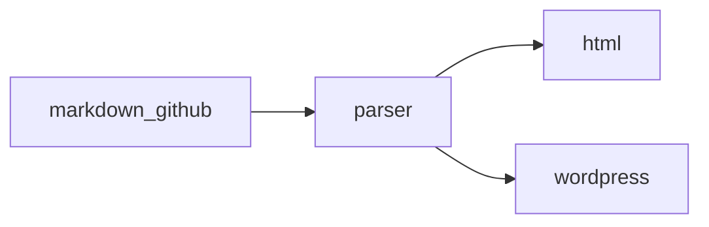

# GitHub Flavored Markdown feature packet

This paragraph uses **bold**, _italic_, ***bold italic***, ~~strikethrough~~, `inline code`, a bare URL https://github.com/openai, an issue-like reference #42, and a mention-like token @octocat.

## Alerts

> [!NOTE]
> GitHub alert syntax should render as a callout-style block, with **inline formatting** inside.

> [!WARNING]
> Alert bodies can contain links such as [GitHub Docs](https://docs.github.com/).

## Task lists

- [x] Parse GFM task list syntax
- [ ] Preserve unchecked tasks
- [x] Render nested formatting with **bold and _italic_ text**
  - [ ] Nested follow-up task with `inline code`
  - [x] Nested completed task with ~~old wording~~

## Table syntax

| Feature | Rendered example | Alignment |
| :--- | :---: | ---: |
| Bold | **This is bold text** | left |
| Italic | _This text is italicized_ | center |
| Strikethrough | ~~This was mistaken text~~ | right |
| Inline code | `git status --short` | code |
| Link | [OpenAI](https://openai.com/) | link |
| Escaped pipe | `a \| b` | cell |

## Code fences

```php
<?php
function render_packet(array $items): string
{
    return implode("\n", array_map('strtoupper', $items));
}
```



## Images and HTML blocks


<details>
<summary>Rendered details block</summary>

GitHub allows raw HTML islands such as collapsible details.

</details>

## Autolinks and references

See https://github.github.com/gfm/, <support@github.com>, and [the CommonMark spec][commonmark].

Footnotes should stay connected to their references.[^gfm-note]

Emoji shortcodes such as :rocket: and :heart: should remain visible for GitHub-style rendering.

[commonmark]: https://spec.commonmark.org/

[^gfm-note]: Footnote bodies can include **formatting**, links, and `code`.